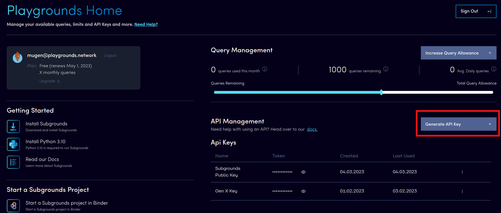
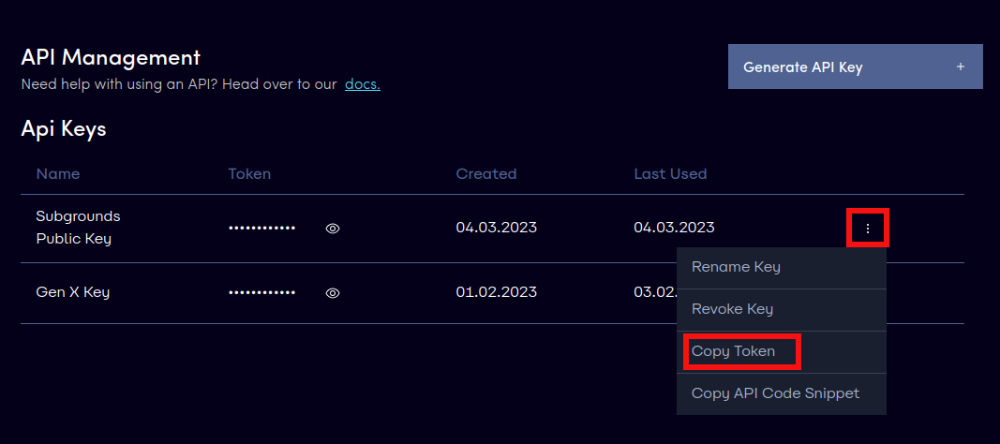
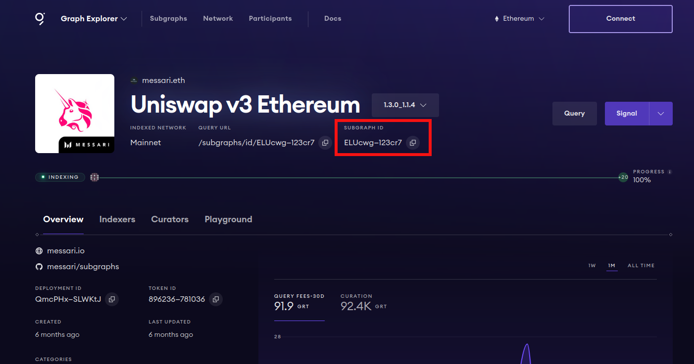

# Playgrounds Gateway
The Playgrounds Gateway is a Playgrounds product designed to simplify querying subgraphs hosted on The Graph's decentralized network. Forget about buying GRTs and managing a wallet, the Playgrounds Gateway allows you to query the Graph's decentralized network for free with a simple API key!

## Getting a Playgrounds API key
### 1. Creating your Playgrounds account
The first step in acquiring a Playgrounds API key is to create a Playgrounds account via our signup [page](https://app.playgrounds.network/signup).

### 2. Create your Playgrounds API key
Once you have created your Playgrounds account and are logged into the Playgrounds app, create a new API key by clicking the "Generate API key" button.



### 3. Copy your Playgrounds API key
Congradulations, you now have a Playgrounds API key that you can use to query decentralized network subgraphs through our proxy API! To copy the actual key itself, you can click on the "..." expander and select the "Copy API Token" option, which will copy the key value to the clipboard.

 

## Querying the decentralized network
Once you have your API key, you can use our proxy API endpoint to query the Graph's decentralized network.

To query a decentralized network subgraph with id `subgraph-id`, you can make a POST request to the Playgrounds proxy endpoint:
```
https://api.playgrounds.network/v1/proxy/subgraphs/id/[subgraph-id]
```

The POST request itself will have to contain the Playgrounds API key you generated earlier as the value of the `Playgrounds-Api-Token` header. The rest of the request will be the same as the request you would usually make to the Graph's decentralized network. Here is an example of Playgrounds Gateway request sent using `curl`:
```
curl https://api.playgrounds.network/v1/proxy/subgraphs/id/ELUcwgpm14LKPLrBRuVvPvNKHQ9HvwmtKgKSH6123cr7 \
    -H 'Content-Type: application/json' \
    -H 'Playgrounds-Api-Key: PG_API_KEY' \
    -d '{"query":"{protocols {id}}"}'
```

Note: This endpoint mirrors the Graph's decentralized network gateway endpoint (see below) with one key difference: the API key is not part of the URL.
```
https://gateway.thegraph.com/api/[api-key]/subgraphs/id/[subgraph-id]
```

### Finding a decentralized subgraph ID
A decentralized network subgraph's can easily be obtained from The Graph's decentralized network [explorer](https://thegraph.com/explorer).



## Using Subgrounds with the Playgrounds Gateway
Altough it is entirely possible to use the Playgrounds Gateway by directly sending requests with a valid Playgrounds API key, the Gateway is most useful when used with Subgrounds. This allows you to leverage Subgrounds and its features to query the Graph's decentralized network with ease. Below is an example of how to use Subgrounds with the decentralized network.

### 1. Initialize Subgrounds object
The first step is to initialize the `Subgrounds` object with a custom header value containing you Playgrounds API key. 
```python
from subgrounds import Subgrounds

sg = Subgrounds(headers={"Playgrounds-Api-Key": "PG_API_KEY"})
```

### 2. Query a decentralized network subgraph
Once the `Subgrounds` object has been initialized with the custom header containing your API key, you can query a decentralized network subgraph through our proxy endpoint just like you would query any other subgraph. 
```python
subgraph = sg.load_subgraph("https://api.playgrounds.network/v1/proxy/subgraphs/id/ELUcwgpm14LKPLrBRuVvPvNKHQ9HvwmtKgKSH6123cr7")

sg.query_df([
    subgraph.Query.tokens.id,
    subgraph.Query.tokens.symbol,
])
```